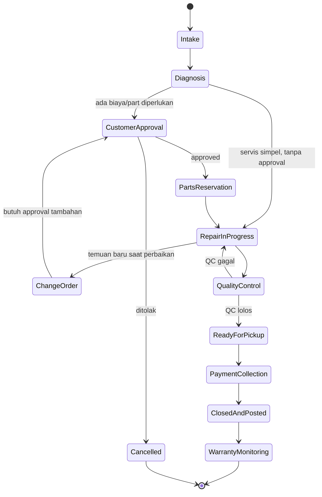

# Alur Kerja Inti: Service Ticket Lifecycle

Ini adalah **jantung produk** — alur yang menyatukan Service, Inventory, POS, dan Finance dalam satu lifecycle yang modular.

## Gambaran Umum

Setiap pekerjaan servis direpresentasikan sebagai **Service Ticket**, yang berjalan melalui serangkaian **stage/node** sesuai **Flow Template** yang dipilih (default atau custom per tenant/jenis servis).

*(Ini adalah default Flow Template. Tenant bisa menghapus/menambah node — misal "Express Service Flow" bisa skip `CustomerApproval` untuk servis di bawah threshold biaya tertentu.)*

## Detail Tiap Stage

| Stage | Aksi Utama | Role Eksekutor | Event yang Di-emit |
|---|---|---|---|
| **Intake** | Catat data customer, asset, keluhan awal | CS, Technician | `ticket.created` |
| **Diagnosis** | Cek kondisi, estimasi part & biaya | Technician | `diagnosis.completed` |
| **Customer Approval** | Kirim quote (WA/portal/SMS), tunggu approve/reject | System (kirim otomatis), Customer (approve via portal) | `approval.requested`, `approval.responded` |
| **Parts Reservation** | Cek stok, reserve part, atau trigger Purchase Order jika kosong | System, Inventory Staff | `parts.reserved`, `po.triggered` (jika stok kosong) |
| **Repair In Progress** | Eksekusi perbaikan, log waktu kerja | Technician | `repair.progress_updated` |
| **Change Order** *(sub-flow, opsional)* | Kalau ada temuan baru → balik ke Customer Approval | Technician | `change_order.raised` |
| **Quality Control** | Checklist verifikasi hasil kerja | Senior Technician/QC role | `qc.passed` / `qc.failed` |
| **Ready for Pickup** | Notifikasi ke customer | System | `customer.notified` |
| **Payment Collection** | Proses pembayaran (POS) | Kasir | `payment.collected` |
| **Closed & Posted** | Finalisasi tiket, posting ke ledger finance | System (otomatis) | `ticket.closed`, `finance.posted` |
| **Warranty Monitoring** | Pantau periode garansi pasca-servis | System | `warranty.tracked` |

## Integrasi Real-Time ke Inventory, POS, Finance

Ini yang membedakan dari aplikasi yang memisahkan ketiga modul — detail penuh sisi inventory-nya ada di [05-workflow-inventory.md](./05-workflow-inventory.md):

| Event dari Ticket | Efek di Inventory | Efek di Finance | Efek di POS |
|---|---|---|---|
| `parts.reserved` | Stok soft-lock (reserved, belum dikurangi) | — | — |
| `repair.progress_updated` (part ditandai used) | Stok hard deduction, cost basis dicatat | COGS tiket bertambah real-time, margin ter-update | Item otomatis masuk draft invoice tiket |
| `payment.collected` | — | Revenue diakui | Invoice difinalisasi, struk diterbitkan |
| `ticket.closed` | — | Journal entry lengkap (COGS + revenue + margin) diposting otomatis | — |

Hasilnya: **pemilik bisa lihat margin per tiket sejak part dipakai**, bukan menunggu laporan bulanan.

## Varian Flow Template (Contoh)

| Flow Template | Beda dari Default | Use Case |
|---|---|---|
| **Express Service Flow** | Skip Customer Approval jika biaya < threshold | Servis cepat, biaya kecil, customer menunggu di tempat |
| **Warranty Claim Flow** | Tambah node "Warranty Verification" sebelum Diagnosis, skip Payment Collection jika full garansi | Klaim garansi |
| **Complex Repair Flow** | Tambah approval kedua dari Branch Manager sebelum Repair In Progress jika estimasi biaya sangat tinggi | Perbaikan besar/mahal |

## Prinsip untuk AI Agent Saat Implementasi

1. Jangan hardcode urutan stage di kode aplikasi — baca dari Flow Template yang tersimpan sebagai data.
2. Setiap stage transition harus melalui validasi Transition Rule (lihat dok 02) dan permission check (lihat dok 03) sebelum dieksekusi.
3. Semua efek ke Inventory/Finance/POS harus lewat event, bukan pemanggilan langsung antar modul — supaya modul tetap independen dan mudah ditest.
4. Kalau ragu apakah sesuatu harus jadi node baru atau logic khusus — defaultkan ke "node baru yang reusable".
