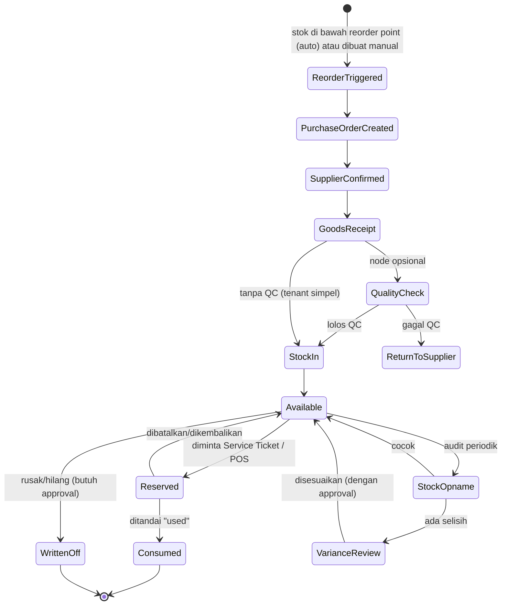

# Alur Kerja Inti: Inventory Flow

Dokumen ini adalah pasangan dari [04-workflow-service-ticket.md](./04-workflow-service-ticket.md) — sama-sama dibangun di atas mesin Flow Template/Flow Node yang sama (lihat [02-architecture-modular.md](./02-architecture-modular.md)), tapi "subjek" yang berjalan melalui stage bukan satu tiket servis, melainkan **setiap unit/batch Inventory Item**.

## Konsep Dasar

Inventory Flow punya dua sisi yang bertemu di satu titik bersama, **Available Stock**:

- **Procurement Flow** — bagaimana barang masuk (dari supplier sampai siap dipakai)
- **Consumption Flow** — bagaimana barang keluar (dipakai di tiket servis, dijual langsung via POS, rusak, atau di-adjust)

Sama seperti Service Ticket, kedua flow ini **modular**: node bisa diaktifkan/dinonaktifkan per tenant. Tenant kecil bisa pakai flow minimal (Purchase → Langsung Pakai), tenant enterprise bisa pakai flow lengkap (dengan QC penerimaan, multi-gudang, approval bertingkat).

## Diagram Lifecycle

## Procurement Flow — Detail Stage

| Stage | Aksi Utama | Role Eksekutor | Event yang Di-emit |
|---|---|---|---|
| **Reorder Triggered** | Sistem deteksi stok di bawah reorder point, atau staff buat PO manual | System / Inventory Staff | `reorder.triggered` |
| **Purchase Order Created** | Susun PO ke supplier (item, qty, harga beli) | Inventory Staff | `po.created` |
| **Supplier Confirmed** *(opsional)* | Supplier konfirmasi qty & estimasi tanggal kirim | Inventory Staff | `po.confirmed` |
| **Goods Receipt** | Barang fisik diterima, dicocokkan dengan PO | Inventory Staff | `goods.received` |
| **Quality Check** *(opsional)* | Cek kondisi barang, ada yang rusak/tidak sesuai spek | Inventory Staff | `qc.passed` / `qc.failed` |
| **Stock In** | Barang resmi masuk stok, lokasi/rak ditentukan | Inventory Staff | `stock.increased` |

## Consumption Flow — Detail Stage

Ada **dua pintu masuk** ke Consumption Flow: dari Service Ticket (stage "Parts Reservation" di [04-workflow-service-ticket.md](./04-workflow-service-ticket.md)) atau dari POS transaksi langsung (jual part/aksesoris tanpa tiket servis).

| Stage | Aksi Utama | Role Eksekutor | Event yang Di-emit |
|---|---|---|---|
| **Reservation Request** | Ticket/POS minta alokasi item tertentu | System | `reservation.requested` |
| **Availability Check** | Cek stok cukup atau tidak | System | `stock.available` / `stock.insufficient` |
| **Reserved (soft-lock)** | Stok ditandai reserved, belum dikurangi fisik | System | `parts.reserved` |
| **Consumed (hard deduction)** | Teknisi/kasir tandai item "used"/"terjual" | Technician / Kasir | `parts.consumed` |
| **Released back to Available** | Reservasi dibatalkan (tiket batal, ganti part) | Technician / System | `reservation.released` |

Kalau **Availability Check** gagal (stok tidak cukup), sistem otomatis memicu **Reorder Triggered** di Procurement Flow — inilah titik temu dua sisi flow ini.

*Catatan FIFO: saat **Consumed (hard deduction)** dieksekusi, sistem tidak langsung mengurangi angka stok begitu saja — ia memilih batch tertua yang masih tersisa (lihat `stock_batches` di bawah), supaya cost basis dan jejak supplier tetap akurat per unit yang terpakai.*

## Stock Adjustment & Audit Sub-flow

| Stage | Aksi Utama | Role Eksekutor | Event yang Di-emit |
|---|---|---|---|
| **Written Off** | Item rusak/hilang di luar proses servis normal | Inventory Staff (butuh approval Branch Manager) | `stock.written_off` |
| **Stock Opname** | Hitung fisik terjadwal, dibandingkan dengan sistem | Inventory Staff | `opname.completed` |
| **Variance Review** | Kalau ada selisih, butuh approval sebelum disesuaikan | Branch Manager / Finance | `variance.approved` / `variance.rejected` |

## Multi-Lokasi & Transfer Antar Cabang

Untuk tenant dengan banyak cabang atau gudang pusat:

- Stok dicatat **per Branch/Warehouse**, bukan per tenant secara flat.
- **Transfer Antar Cabang** adalah sub-flow tersendiri: `TransferRequested → TransferShipped → TransferReceived`, yang di belakang layar setara dengan "Consumption" di cabang asal + "Procurement" (tanpa PO ke supplier eksternal) di cabang tujuan.
- Ini adalah node opsional — tenant single-branch tidak perlu mengaktifkannya.

## Integrasi Real-Time ke Finance & POS

| Event dari Inventory | Efek di Finance | Efek di POS/Ticket |
|---|---|---|
| `stock.increased` (Stock In) | Update nilai persediaan (asset), tidak langsung jadi expense | — |
| `parts.reserved` | — | Item muncul sebagai "pending" di draft invoice tiket |
| `parts.consumed` | COGS dicatat ke ledger tiket/transaksi terkait, real-time | Item terkunci di invoice, harga jual terhitung |
| `stock.written_off` | Dicatat sebagai kerugian (loss), butuh approval sebelum posting | — |
| `variance.approved` | Penyesuaian nilai persediaan di ledger | — |

## Metode Costing

**Keputusan final (direvisi): FIFO (First In First Out) dengan batch tracking per supplier.**

Setiap kali stok masuk (Goods Receipt), sistem membuat **batch baru** (`stock_batches`) yang menyimpan: supplier asal, harga beli ASLI batch itu (bukan rata-rata), dan jumlah yang diterima. Saat part dikonsumsi, sistem otomatis mengambil dari **batch tertua yang masih ada sisa stoknya** (urutan FIFO murni berdasar `received_at`) — kalau 1 kali konsumsi melebihi sisa 1 batch, sistem pecah otomatis ke batch berikutnya, dicatat sebagai baris `stock_movements` terpisah per batch.

Kenapa perlu tahu batch & supplier asalnya, bukan cuma urutan waktu saja? Karena kalau part yang sudah terpasang di tiket ternyata cacat, staff perlu tahu **persis dari supplier mana** part itu dibeli, supaya retur/klaim garansi diarahkan ke supplier yang benar — sesuai `returnPolicyDays` dan `warrantyPolicyDays` masing-masing supplier (lihat [03-rbac-roles.md](./03-rbac-roles.md) dan `db/schema.ts`).

`inventory_items.unit_cost_avg` tetap disimpan sebagai nilai referensi cepat untuk tampilan (misal daftar produk), tapi COGS yang sebenarnya selalu dihitung dari batch yang benar-benar terpakai, bukan dari rata-rata ini.

## Contoh Konfigurasi per Skala Tenant

| Skala Tenant | Node yang Diaktifkan |
|---|---|
| **Single-branch kecil** | Purchase Order Created → Goods Receipt → Stock In → Reserved → Consumed *(skip QC, skip multi-gudang, skip transfer)* |
| **Multi-cabang menengah** | + Supplier Confirmed, + Stock Opname terjadwal |
| **Enterprise/multi-gudang** | + Quality Check, + Transfer Antar Cabang, + Variance Review berlapis |

## Prinsip untuk AI Agent Saat Implementasi

1. Inventory Item punya **state per unit/batch**, bukan cuma angka quantity — supaya bisa lacak sejak masuk (Procurement) sampai keluar (Consumption/Write-off).
2. `Reserved` (soft-lock) dan `Consumed` (hard deduction) **harus dua state terpisah** — jangan langsung deduct stok saat reservasi, karena tiket bisa batal/berubah.
3. Semua perubahan stok wajib tercatat sebagai **Stock Movement** (ledger append-only) — jangan cuma update angka `quantity` di tabel item tanpa jejak.
4. Reorder point & auto-PO trigger harus dikonfigurasi per item per branch, bukan angka global.
