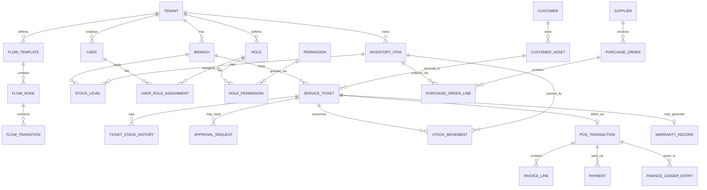

# Data Model & Entity Reference

Dokumen ini adalah model data konseptual/logis — bukan DDL SQL final. Tujuannya memberi AI agent dan developer peta entitas sebelum menulis schema aktual (yang bergantung pada database pilihan, lihat [10-tech-stack-infra.md](./10-tech-stack-infra.md)).

## Entity Relationship Diagram (Ringkas)

## Entitas Inti & Field Utama

### Tenant
| Field | Tipe | Catatan |
|---|---|---|
| id | UUID | Primary key |
| name | string | Nama perusahaan |
| subscription_tier | enum | Menentukan limit cabang/user/fitur |
| status | enum | active, suspended, trial |
| created_at | timestamp | |

### Branch
| Field | Tipe | Catatan |
|---|---|---|
| id | UUID | |
| tenant_id | UUID (FK) | **Wajib ada di hampir semua tabel** untuk isolasi tenant |
| name | string | |
| address | string | |

### User
| Field | Tipe | Catatan |
|---|---|---|
| id | UUID | |
| tenant_id | UUID (FK) | |
| name, email | string | |
| password_hash | string | |
| status | enum | active, invited, disabled |

### Role & Permission
| Tabel | Field Kunci | Catatan |
|---|---|---|
| `role` | id, tenant_id, name, is_custom | Role bawaan vs custom per tenant |
| `permission` | id, code, description | Kode global, sama untuk semua tenant (mis. `ticket.approve_quote`) |
| `role_permission` | role_id, permission_id | Junction table |
| `user_role_assignment` | user_id, role_id, branch_id (nullable) | `branch_id` null = berlaku semua cabang |

### FlowTemplate, FlowNode, FlowTransition
| Tabel | Field Kunci | Catatan |
|---|---|---|
| `flow_template` | id, tenant_id, domain (service/inventory), name, is_default, version | |
| `flow_node` | id, flow_template_id, name, sequence_order, node_type, required_permission_id | |
| `flow_transition` | id, from_node_id, to_node_id, condition_expression | Aturan pindah stage |

### ServiceTicket
| Field | Tipe | Catatan |
|---|---|---|
| id | UUID | |
| tenant_id, branch_id | UUID (FK) | |
| customer_id, customer_asset_id | UUID (FK) | |
| flow_template_id | UUID (FK) | Flow yang dipakai tiket ini |
| current_node_id | UUID (FK) | Stage saat ini |
| status | enum | open, closed, cancelled |
| created_at, closed_at | timestamp | |

### InventoryItem & StockMovement
| Tabel | Field Kunci | Catatan |
|---|---|---|
| `inventory_item` | id, tenant_id, sku, name, category_id, unit_cost_avg, reorder_point, unit_of_measure | |
| `stock_level` | inventory_item_id, branch_id, quantity_available, quantity_reserved | |
| `stock_movement` | id, tenant_id, branch_id, inventory_item_id, movement_type (in/out/reserve/release/adjust), quantity, reference_type, reference_id, created_at | Ledger append-only, jangan pernah di-update/delete |

### PurchaseOrder & Supplier
| Tabel | Field Kunci | Catatan |
|---|---|---|
| `supplier` | id, tenant_id, name, contact_info | |
| `purchase_order` | id, tenant_id, branch_id, supplier_id, status, created_at | |
| `purchase_order_line` | id, purchase_order_id, inventory_item_id, quantity, unit_price | |

### POSTransaction, InvoiceLine, Payment, FinanceLedgerEntry
| Tabel | Field Kunci | Catatan |
|---|---|---|
| `pos_transaction` | id, tenant_id, branch_id, service_ticket_id (nullable), status, total_amount | `service_ticket_id` null = transaksi retail langsung |
| `invoice_line` | id, pos_transaction_id, description, quantity, unit_price, source_type (part/labor/fee) | |
| `payment` | id, pos_transaction_id, method, amount, paid_at | Mendukung partial/DP |
| `finance_ledger_entry` | id, tenant_id, branch_id, entry_type (COGS/revenue/adjustment), amount, reference_type, reference_id, posted_at | |

## Prinsip Desain Data Model

1. **`tenant_id` wajib ada di setiap tabel domain** (kecuali tabel global seperti `permission`) — dan setiap query WAJIB difilter oleh `tenant_id` di level aplikasi/ORM, tidak boleh mengandalkan client mengirim tenant_id yang benar.
2. **Stock Movement dan Finance Ledger bersifat append-only** — histori tidak boleh di-overwrite; kalau ada koreksi, buat entry baru yang membalik (reversal entry), bukan edit entry lama.
3. **Flow Template/Node/Transition disimpan sebagai data**, bukan enum hardcoded di kode — konsisten dengan prinsip modularitas di [02-architecture-modular.md](./02-architecture-modular.md).
4. Pertimbangkan **soft-delete** (kolom `deleted_at`) untuk entitas transaksional penting (ticket, invoice) demi audit trail, bukan hard delete.
