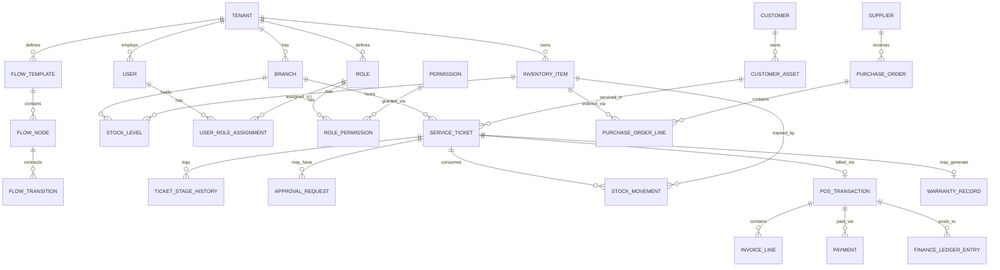

# Data Model & Entity Reference

This document is the conceptual/logical data model. The actual DDL lives in `db/schema.ts` (Drizzle).

## Entity Relationship Diagram

## Core Entities & Key Fields

### Tenant
| Field | Type | Notes |
|-------|------|-------|
| id | UUID | Primary key |
| name | string | Company name |
| subscription_tier | enum | Determines branch/user/feature limits |
| status | enum | active, suspended, trial |
| created_at | timestamp | |

### Branch
| Field | Type | Notes |
|-------|------|-------|
| id | UUID | |
| tenant_id | UUID (FK) | **Must exist on nearly all tables** for tenant isolation |
| name | string | |
| address | string | |

### User
| Field | Type | Notes |
|-------|------|-------|
| id | UUID | |
| tenant_id | UUID (FK) | |
| name, email | string | |
| password_hash | string | |
| status | enum | active, invited, disabled |

### Role & Permission
| Table | Key Fields | Notes |
|-------|-----------|-------|
| `roles` | id, tenant_id, name, is_custom | Built-in vs custom roles per tenant |
| `permissions` | id, code, description | Global codes, same for all tenants (e.g., `ticket.approve_quote`) |
| `role_permissions` | role_id, permission_id | Junction table |
| `user_role_assignments` | user_id, role_id, branch_id (nullable) | `branch_id` null = applies to all branches |

### Flow Template, Flow Node, Flow Transition
| Table | Key Fields | Notes |
|-------|-----------|-------|
| `flow_templates` | id, tenant_id, domain (service/inventory), name, is_default, version | |
| `flow_nodes` | id, flow_template_id, name, sequence_order, node_type, required_permission_id | |
| `flow_transitions` | id, from_node_id, to_node_id, condition_expression | Stage transition rules |

### Service Ticket
| Field | Type | Notes |
|-------|------|-------|
| id | UUID | |
| tenant_id, branch_id | UUID (FK) | |
| customer_id, customer_asset_id | UUID (FK) | |
| flow_template_id | UUID (FK) | Which flow this ticket follows |
| current_node_id | UUID (FK) | Current stage |
| status | enum | open, closed, cancelled |
| created_at, closed_at | timestamp | |

### Inventory Item & Stock Movement
| Table | Key Fields | Notes |
|-------|-----------|-------|
| `inventory_items` | id, tenant_id, sku, name, category_id, unit_cost_avg, reorder_point, unit_of_measure | |
| `stock_levels` | inventory_item_id, branch_id, quantity_available, quantity_reserved | |
| `stock_movements` | id, tenant_id, branch_id, inventory_item_id, movement_type (in/out/reserve/release/adjust), quantity, reference_type, reference_id, created_at | **Append-only ledger — never update/delete** |

### Purchase Order & Supplier
| Table | Key Fields | Notes |
|-------|-----------|-------|
| `suppliers` | id, tenant_id, name, contact_info | |
| `purchase_orders` | id, tenant_id, branch_id, supplier_id, status, created_at | |
| `purchase_order_lines` | id, purchase_order_id, inventory_item_id, quantity, unit_price | |

### POS Transaction, Invoice, Payment, Finance Ledger
| Table | Key Fields | Notes |
|-------|-----------|-------|
| `pos_transactions` | id, tenant_id, branch_id, service_ticket_id (nullable), status, total_amount | `service_ticket_id` null = standalone retail transaction |
| `invoice_lines` | id, pos_transaction_id, description, quantity, unit_price, source_type (part/labor/fee) | |
| `payments` | id, pos_transaction_id, method, amount, paid_at | Supports partial/deposit |
| `finance_ledger_entries` | id, tenant_id, branch_id, entry_type (COGS/revenue/adjustment), amount, reference_type, reference_id, posted_at | |

## Data Model Design Principles

1. **`tenant_id` is mandatory on every domain table** (except global tables like `permissions`) — every query MUST filter by `tenant_id` at application/ORM level.
2. **Stock Movement and Finance Ledger are append-only** — history must never be overwritten; corrections use reversal entries, not edits.
3. **Flow Template/Node/Transition are stored as data**, not hardcoded enums — consistent with modularity principle.
4. Use **soft-delete** (`deleted_at` column) for important transactional entities (ticket, invoice) for audit trail.
